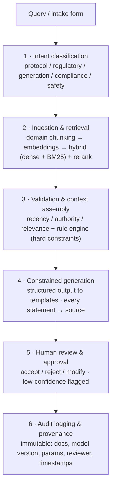
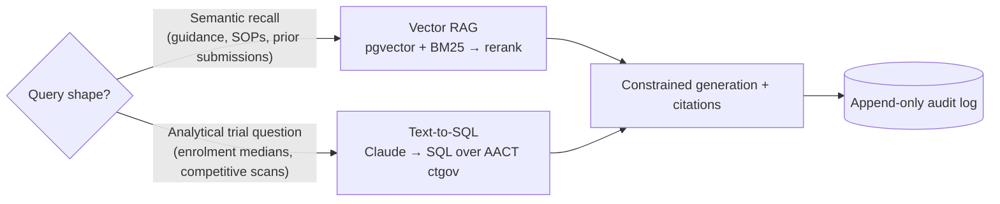
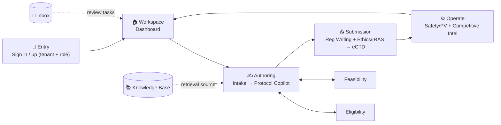
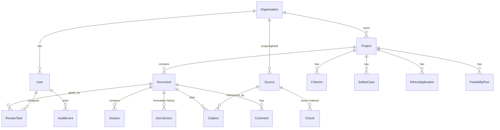

# 🧬 Cohortly — Project Overview

> **An AI-native operating system for clinical development documentation and regulatory intelligence.**
> Every AI-generated statement is evidence-backed, traceable to source, version-controlled, and human-reviewable — built on a **Retrieval-Augmented Generation (RAG) core, not open-ended chat**.
>
> This is the single grounding document for AI-assisted development (Claude Code). Read it before writing code. It synthesizes the **Developer Handoff Specification v1.0** and the **14 hi-fi screens**.

**Stack at a glance:** [Next.js](https://nextjs.org/docs/app) (App Router) · [PostgreSQL](https://www.postgresql.org/docs/) + [pgvector](https://github.com/pgvector/pgvector) · [Prisma](https://www.prisma.io/docs) · [shadcn/ui](https://ui.shadcn.com) + [Tailwind](https://tailwindcss.com) · Python AI service ([FastAPI](https://fastapi.tiangolo.com) + [LangGraph](https://www.langchain.com/langgraph)) · [21 CFR Part 11](https://www.ecfr.gov/current/title-21/part-11)

> ⚠️ **Naming:** The product is **Cohortly**. The hi-fi screens still carry the earlier **"Cohort"** wordmark — treat *Cohortly* as canonical and rename the wordmark when building the shell.

---

## 📑 Contents

1. [Product & scope](#1--product--scope)
2. [System architecture](#2--system-architecture)
3. [Technology stack](#3--technology-stack)
4. [Application structure](#4--application-structure)
5. [Screen inventory (14)](#5--screen-inventory-14)
6. [Navigation & user flow](#6--navigation--user-flow)
7. [Data model (Prisma + ERD)](#7--data-model-prisma--erd)
8. [API surface](#8--api-surface)
9. [Design system](#9--design-system)
10. [Auth, RBAC & compliance](#10--auth-rbac--compliance)
11. [Delivery roadmap](#11--delivery-roadmap)
12. [Engineering checklist](#12--engineering-checklist)
13. [Working with Claude Code](#13--working-with-claude-code)
14. [Reference links](#14--reference-links)

---

## 1. 🎯 Product & scope

Cohortly generates and validates clinical development documentation — protocols, eligibility criteria, regulatory submissions, ethics documents, informed-consent forms, safety narratives, and eCTD dossiers. It is distinguished from generic AI tools by **compliance infrastructure, domain knowledge, and audit-grade provenance**.

**Value propositions**

- ⚡ Accelerate protocol development **40–60%** via AI-assisted generation grounded in [SPIRIT 2013](https://www.spirit-statement.org) and [ICH E6(R3)](https://www.ich.org/page/efficacy-guidelines).
- ✅ Reduce submission errors through real-time compliance checking against FDA, EMA, MHRA, and ICH guidance.
- 🛟 Automate safety narratives (SAE, DSUR, ICSR) so medical monitors focus on clinical judgment.
- 🏛️ Streamline ethics / [IRAS](https://www.hra.nhs.uk) submissions through automated assembly and HRA compliance checks.
- 🔒 Full audit trail and provenance tracking for 21 CFR Part 11 and GxP.

**Target users & default roles**

| Segment | Primary use | Default role |
|---|---|---|
| Regulatory Affairs | IND/CTA prep, regulatory writing, pathway strategy | `ra_lead` |
| Clinical Operations | Eligibility, study design, recruitment, CRF design | `clin_ops` |
| Medical Writers | CSR drafting, CTD summaries, ICFs | `med_writer` |
| Pharmacovigilance | SAE narratives, ICSRs, DSURs, signal detection | `pv` |
| Quality Assurance | Compliance checking, audit review, GxP validation | `qa_reviewer` |
| NHS / Academic | Ethics submissions, IRAS, protocol QA, HRA compliance | `researcher` |
| Org admin | Tenant setup, user/role management, KB sources | `tenant_admin` |

> 🏢 **Multi-tenant from day one.** Every record is scoped to an `Organization` (tenant). Row-level isolation is enforced in the **data layer** — never rely on the client to filter by tenant. A **UK data-residency** option is required for NHS customers.

---

## 2. 🏗️ System architecture

A modular system with a RAG core and a multi-agent orchestration layer. The Next.js app is the **presentation + BFF tier**; heavy AI/RAG work runs in a **Python service** the frontend calls over an internal API.

### Service topology

```mermaid
flowchart LR
  B["🖥️ Browser · Next.js UI"]

  subgraph WEB["Next.js App · BFF (TypeScript)"]
    SA["Server Actions<br/>(tenant-scoped CRUD)"]
    RH["Route Handlers<br/>(streaming proxy)"]
  end

  subgraph AI["Python AI Service · FastAPI + LangGraph"]
    RAG["Hybrid retrieval + rerank"]
    SQL["Text-to-SQL"]
    GEN["Constrained generation"]
  end

  subgraph PG[("PostgreSQL · one engine")]
    OP[("Operational tables<br/>Prisma")]
    VEC[("pgvector chunks")]
    AACT[("AACT · ctgov<br/>read-only")]
  end

  S3[("S3 · versioned blobs / exports")]

  B --> SA --> OP
  B --> RH --> AI
  AI --> VEC
  AI --> AACT
  SA --> S3
```

### RAG pipeline — six stages



### Two retrieval paths over one Postgres engine

Retrieval splits by **query shape**, but both paths land in the **same Postgres instance** — the pgvector regulatory corpus and a self-hosted AACT snapshot co-located. This is the **consolidation spine**: structured trial data and the regulatory retrieval layer behind one engine, one audit trail.



| Path | For | How |
|---|---|---|
| **Vector RAG** | Regulatory guidance, guidelines, SOPs, prior submissions — semantic recall | Hybrid dense (pgvector) + BM25, reranked → constrained generation with citations |
| **Text-to-SQL** | Analytical trial questions, competitive scans, sponsor breakdowns | Claude generates SQL against a curated AACT schema → synthesises the answer from returned rows |

Because both live in one engine, a single statement can **join AACT precedent rows against retrieved regulatory chunks**, and every retrieval writes to the same append-only log. Fixed keyword-filter REST APIs (`query.cond`, `query.intr`, `status`) cannot express the joins/aggregation the analytical questions require — which is why the API path was rejected.

> 🗓️ **Nightly snapshot → audit reproducibility.** AACT is refreshed by a nightly job, giving every answer a fixed *data-as-of* date — materially better for 21 CFR Part 11 reproducibility than a live API (where the same query can return different rows between runs). Ops cost: one Postgres instance carrying the AACT dump (several GB) + a daily refresh job.

> 🧱 **Frontend boundary.** The Next.js app owns auth, tenant scoping, and all CRUD on the operational Postgres via Prisma, and **proxies** generation + retrieval to the Python AI service (streaming back to the client). It does **not** embed the LLM, generate SQL, or run vector math directly. The AACT corpus is **read-only** to the app.

---

## 3. 🧰 Technology stack

| Layer | Choice | Notes |
|---|---|---|
| **Web app / BFF** | [Next.js (latest)](https://nextjs.org/docs/app), App Router only, TypeScript strict | Server Components by default; Server Actions for mutations; route handlers for streaming/webhooks |
| **AI orchestration** | Python · [FastAPI](https://fastapi.tiangolo.com) · [LangGraph](https://www.langchain.com/langgraph) | Multi-agent coordination per document type & workflow |
| **RAG pipeline** | [LangChain](https://www.langchain.com) (preferred) | Hybrid retrieval + rerank + constrained generation |
| **Primary DB** | [PostgreSQL](https://www.postgresql.org/docs/) (ACID) | Tenant, project, document, audit, review state |
| **Vector store** | [pgvector](https://github.com/pgvector/pgvector) (same Postgres) | Embeddings + metadata filtering, ANN via raw SQL |
| **Trial data** | Self-hosted [AACT](https://aact.ctti-clinicaltrials.org) (same Postgres, `ctgov` schema) | [ClinicalTrials.gov](https://clinicaltrials.gov) precedent data, queried with SQL |
| **Search** | Postgres FTS / [OpenSearch](https://opensearch.org) | BM25 lexical retrieval |
| **Object storage** | S3-compatible | Versioned document blobs, uploads, exports |
| **ORM** | [Prisma](https://www.prisma.io/docs) | Typed client; `prisma migrate` (reviewed, never auto in prod); pgvector via `Unsupported("vector")` + raw ANN queries; audit middleware stamps `createdBy` |
| **UI** | [shadcn/ui](https://ui.shadcn.com) + [Tailwind](https://tailwindcss.com) ([Radix](https://www.radix-ui.com) under the hood) | Components copied into `components/ui`, themed to Cohortly tokens |
| **Icons / charts** | [lucide-react](https://lucide.dev) · [Recharts](https://recharts.org) | Forecast/feasibility/competitive charts |

**Supporting libraries**

| Concern | Choice | Notes |
|---|---|---|
| Auth | [Auth.js](https://authjs.dev) or [WorkOS](https://workos.com) | SAML/OIDC SSO, MFA; WorkOS preferred for enterprise SSO breadth |
| Rich editing | [TipTap](https://tiptap.dev) (ProseMirror) | Protocol & regulatory editors; inline citation marks |
| Streaming AI UI | [Vercel AI SDK](https://github.com/vercel/ai) | `useChat` / `useCompletion` against the AI-service proxy |
| Forms | [react-hook-form](https://react-hook-form.com) + [zod](https://zod.dev) | Intake, IRAS sections, auth |
| Tables | [TanStack Table](https://tanstack.com/table) | Projects, criteria, competing trials, audit log |
| Client cache | [TanStack Query](https://tanstack.com/query) | Where interactivity is heavy (editors) |
| PDF / eCTD export | react-pdf / server render | Submission packs, narratives |
| Background jobs | [Inngest](https://www.inngest.com) or [BullMQ](https://docs.bullmq.io) | Long generations, KB ingestion, sync jobs |

> 🧪 **Validated system note.** GxP-regulated software: pin dependency versions, keep a lockfile, treat upgrades as change-controlled. **Generation features must be feature-flagged** so they can be disabled per-tenant during validation (IQ/OQ/PQ).

---

## 4. 🗂️ Application structure

```text
app/
├─ (auth)/                      # unauthenticated, no app shell
│  ├─ sign-in/page.tsx
│  ├─ sign-up/page.tsx          # 4-step wizard
│  └─ layout.tsx                # split marketing panel
├─ (app)/                       # authed, sidebar + topbar shell
│  ├─ layout.tsx                # <Sidebar/> + <TopBar/>, tenant guard
│  ├─ dashboard/page.tsx
│  ├─ projects/
│  │  ├─ page.tsx               # grid / table / timeline
│  │  └─ [projectId]/page.tsx
│  ├─ inbox/page.tsx
│  ├─ protocols/
│  │  ├─ new/page.tsx           # intake (prompt) screen
│  │  └─ [id]/page.tsx          # Protocol Copilot editor
│  ├─ eligibility/[id]/page.tsx
│  ├─ feasibility/[id]/page.tsx
│  ├─ writing/[docId]/page.tsx
│  ├─ ethics/[id]/page.tsx      # IRAS assistant
│  ├─ safety/
│  │  ├─ page.tsx               # narrative queue
│  │  └─ [saeId]/page.tsx
│  ├─ intel/page.tsx            # competitive intelligence
│  └─ knowledge/page.tsx        # KB search
├─ api/
│  ├─ generate/route.ts         # streaming proxy → AI service
│  ├─ kb/search/route.ts
│  ├─ trials/query/route.ts     # text-to-SQL over AACT
│  └─ webhooks/
└─ layout.tsx                   # fonts, providers, theme
```

**Rendering strategy** — Server Components by default; `"use client"` only on genuinely interactive leaves (editors, forms, sliders, charts, menus), pushed as far down the tree as possible.

| Screen type | Approach | Why |
|---|---|---|
| Dashboard, Projects, Inbox, Intel | RSC + server fetch, Suspense streaming | Read-heavy, fast first paint, tenant-scoped |
| Protocol Copilot, Reg Writing | Client editor island + server actions | TipTap interactivity, optimistic edits, autosave |
| Intake, IRAS, Auth | Client forms (RHF) + server-action submit | Validation, multi-step state |
| Knowledge Base | Route handler, streamed answer | RAG synthesis streams token-by-token |
| Feasibility, Eligibility | Client islands (charts/sliders) over server data | Live what-if modelling |

> 📱 The `(app)/layout.tsx` renders the persistent **Sidebar** (3 nav groups) and **TopBar** (breadcrumb, ⌘K search, notifications). On mobile these collapse to a bottom **TabBar + sheet menu**.

---

## 5. 🖼️ Screen inventory (14)

Every screen is responsive (desktop + mobile). The hi-fi prototype is the **visual source of truth**.

| # | Domain | Screen | Route | Key data / components |
|---|---|---|---|---|
| S01–02 | Entry | Sign in / Sign up | `/(auth)/sign-in`, `/sign-up` | Split layout; SSO (SAML/OIDC, Google/Microsoft/ORCID), MFA; 4-step wizard with role selection |
| S03 | Workspace | **Dashboard** | `/(app)/dashboard` | KPI strip (active studies, docs in review, open queries, AI evidence coverage), My-queue review list w/ confidence, Regulatory Pulse feed, today's audit trail, active-studies grid |
| S04 | Workspace | **Projects** | `/(app)/projects` | Grid / Table / Timeline; filter chips (phase/indication/status); cards with enrolment progress; `Project[]` |
| S05 | Workspace | **Inbox** | `/(app)/inbox` | Two-pane; threads (reviews, @mentions, regulator updates, AI safety flags); filters; "Draft with Cohortly" + cite source |
| S06 | Authoring | **Protocol intake** | `/(app)/protocols/new` | 3 modes: Guided form / Freeform prompt / Import (.docx/.pdf/NCT ID); footer source-count + ETA → `POST /api/generate` |
| S07 | Authoring | **Protocol Copilot** | `/(app)/protocols/[id]` | 3-pane: section nav + compliance meters (SPIRIT/ICH/MHRA CTA) · TipTap doc w/ citation chips + recommendation cards · retrieved-sources rail; `Document, Section, Citation, Source, Suggestion` |
| S08 | Authoring | **Eligibility Engine** | `/(app)/eligibility/[id]` | Feasibility headline; criteria table (IN/EX, score, source, reg-mandated, warnings); scenario toggles, demographic vs FDA diversity, site readiness; `Criterion, FeasibilityRun` |
| S09 | Intelligence | **Feasibility Simulator** | `/(app)/feasibility/[id]` | KPI row; enrolment forecast P10/P50/P90 + CI (Recharts); Monte-Carlo levers; site landscape; competing trials; `FeasibilityRun, Site, CompetingTrial` |
| S10 | Submission | **Regulatory Writing** | `/(app)/writing/[docId]` | eCTD tree (Module 1–5) + consistency check; TipTap w/ pinned reviewer flags, AI-drafted blocks (accept/edit/reject/regenerate); provenance hash; export eCTD/PDF; `Document, CtdModule, Comment, Citation` |
| S11 | Submission | **Ethics & IRAS** | `/(app)/ethics/[id]` | IRAS sections A–H + completion meter + required-docs checklist; auto-populated answers w/ confidence; PIS readability; HRA checks, REC timeline, NIHR portfolio; `EthicsApplication, FormSection, Document` |
| S12 | Operate | **Safety & PV** | `/(app)/safety`, `/safety/[saeId]` | Structured case data (demographics, MedDRA event, con-meds, history); AI narrative from CRF + reporting clock; narrative queue (15/30-day), signal detection (PRR/χ²), cumulative safety; E2B(R3) export; `SafetyCase, Narrative, Signal, MedDRATerm` |
| S13 | Intelligence | **Competitive Intel** | `/(app)/intel` | KPI strip (active trials, approvals, pool overlap, site collisions, milestones); competing-trials table (threat/velocity); label decisions; patent/exclusivity cliff watch; site-overlap heatmap → Feasibility; `CompetingTrial, Approval, Site` |
| S14 | Intelligence | **Knowledge Base** | `/(app)/knowledge` | Semantic search w/ source filters; streamed synthesised answer + inline citations + "insert into document"; ranked passage cards (score/authority/cited-count); index health; `Source, Chunk (vector), Citation` |

> 🧩 **Three shared components recur everywhere generation appears** — build once, reuse: `<Citation/>` (chip `[n] source`), `<Confidence/>` (colour-coded % bar), `<AIDraftBlock/>` (accept/edit/reject/regenerate + source count + model version). They encode the human-in-the-loop + provenance requirements.

---

## 6. 🧭 Navigation & user flow

**Navigation model**

| Group | Items (lucide icon) |
|---|---|
| **Workspace** | Dashboard `layout-dashboard` · Projects `layers` · Inbox `inbox` |
| **Authoring** | Protocol Copilot `flask-conical` · Eligibility Engine `users` · Regulatory Writing `file-text` · Safety & PV `shield` · Ethics & IRAS `scale` |
| **Intelligence** | Feasibility Simulator `activity` · Competitive Intel `globe` · Knowledge Base `book-open` |

**Primary happy path** (5 lanes)



> ⏳ **Generation is always a job, never a blocking request.** Protocol/document generation can take minutes — kick off async, show progress, stream partials, let the user navigate away; the result lands in their Inbox + the document. Never hold an HTTP request open for a full protocol draft.

---

## 7. 🗃️ Data model (Prisma + ERD)

### Entity-relationship overview



### Core Prisma schema

> Models below combine the handoff spec (faithful) with **inferred** extensions (marked) so the schema is coherent to scaffold from. Embedding dimension is **1536**; tune to your embedding model.

```prisma
// datasource db { provider = "postgresql"; url = env("DATABASE_URL") }
// generator client { provider = "prisma-client-js"; previewFeatures = ["postgresqlExtensions"] }
// Enable pgvector: CREATE EXTENSION IF NOT EXISTS vector;

enum OrgType        { NHS ACADEMIC BIOTECH CRO PHARMA }
enum Role           { ra_lead clin_ops med_writer pv qa_reviewer researcher tenant_admin }
enum ProjectStatus  { DRAFT PRE_IND IN_SCREENING RECRUITING IN_FOLLOW_UP REPORTING COMPLETED }
enum DocType        { PROTOCOL CSR CTD_2_7 IND ICF NARRATIVE IRAS }
enum DocStatus      { DRAFT IN_REVIEW APPROVED LOCKED }
enum SectionStatus  { EMPTY DRAFT FLAGGED COMPLETE }
enum CriterionKind  { INCLUSION EXCLUSION }
enum ReviewStatus   { PENDING APPROVED REJECTED CHANGES }

model Organization {
  id            String    @id @default(cuid())
  name          String
  type          OrgType
  dataResidency String    @default("uk")
  users         User[]
  projects      Project[]
  createdAt     DateTime  @default(now())
}

model User {
  id             String       @id @default(cuid())
  email          String       @unique
  name           String
  role           Role
  organizationId String
  organization   Organization @relation(fields: [organizationId], references: [id])
  reviews        ReviewTask[]
  auditEvents    AuditEvent[]
}

model Project {                              // a study / trial
  id              String        @id @default(cuid())
  code            String                     // e.g. "MAP-204"
  title           String
  phase           String
  indication      String
  therapeuticArea String
  status          ProjectStatus
  jurisdictions   String[]                   // ["MHRA","FDA","EMA"]
  targetEnrolment Int?
  organizationId  String
  organization    Organization  @relation(fields: [organizationId], references: [id])
  documents       Document[]
  criteria        Criterion[]
  safetyCases     SafetyCase[]
  ethicsApps      EthicsApplication[]
  feasibilityRuns FeasibilityRun[]
  createdAt       DateTime      @default(now())
  updatedAt       DateTime      @updatedAt
  @@index([organizationId, status])
}

model Document {
  id        String       @id @default(cuid())
  type      DocType
  title     String
  status    DocStatus    @default(DRAFT)
  projectId String
  project   Project      @relation(fields: [projectId], references: [id])
  sections  Section[]
  versions  DocVersion[]                     // git-style immutable history
  citations Citation[]
  comments  Comment[]
  reviews   ReviewTask[]
}

model Section {
  id              String        @id @default(cuid())
  number          String                     // "4", "2.7.4"
  heading         String
  contentJson     Json                       // TipTap doc
  complianceScore Float?                     // SPIRIT/ICH coverage 0–1
  status          SectionStatus @default(DRAFT)
  documentId      String
  document        Document      @relation(fields: [documentId], references: [id])
}

model Citation {                             // links generated text → source evidence
  id         String   @id @default(cuid())
  documentId String
  document   Document @relation(fields: [documentId], references: [id])
  sourceId   String
  source     Source   @relation(fields: [sourceId], references: [id])
  quote      String                          // the retrieved passage
  locator    String?                         // "§5.18", "p.47"
  confidence Float
}

model Source {                               // a KB document (regulatory or internal)
  id             String    @id @default(cuid())
  authority      String                      // FDA | EMA | MHRA | ICH | Internal | CT.gov
  title          String
  kind           String                      // Guidance | Guideline | SOP | Trial record
  jurisdiction   String?
  publishedAt    DateTime?
  chunks         Chunk[]
  citations      Citation[]
  organizationId String?                     // null = global/shared corpus
}

model Chunk {                                // vector-indexed passage (pgvector)
  id        String                  @id @default(cuid())
  sourceId  String
  source    Source                  @relation(fields: [sourceId], references: [id])
  content   String
  embedding Unsupported("vector(1536)")      // ANN via raw SQL
  metadata  Json                             // docType, TA, pathway, version
  @@index([sourceId])
}

model Criterion {
  id          String        @id @default(cuid())
  projectId   String
  project     Project       @relation(fields: [projectId], references: [id])
  kind        CriterionKind
  text        String
  feasibility Int                            // 0–100
  regMandated Boolean       @default(false)
  sourceRef   String?
}

model ReviewTask {                           // human-in-the-loop gate
  id         String       @id @default(cuid())
  documentId String
  document   Document     @relation(fields: [documentId], references: [id])
  assigneeId String
  assignee   User         @relation(fields: [assigneeId], references: [id])
  status     ReviewStatus @default(PENDING)
  confidence Float?
  dueAt      DateTime?
}

model AuditEvent {                           // append-only · 21 CFR Part 11
  id               String   @id @default(cuid())
  actorId          String?                   // null = system/AI
  actor            User?    @relation(fields: [actorId], references: [id])
  actorKind        String                    // USER | AI | SYSTEM
  action           String                    // "approved" | "edited" | "retrieved" | "locked"
  target           String                    // "Document:cuid"
  modelVersion     String?                   // AI provenance
  meta             Json?
  signatureMeaning String?                   // e-sig "meaning of signature"
  createdAt        DateTime @default(now())
  @@index([target, createdAt])
}

// ── Inferred extensions (not in abridged spec; shape to taste) ───────────────
// model DocVersion        { id, documentId, snapshotJson, hash, createdById, createdAt }   // insert-only
// model Comment           { id, documentId, authorId, body, anchor, resolved, createdAt }
// model Suggestion        { id, sectionId, text, kind, confidence, status, sources Json }
// model FeasibilityRun     { id, projectId, scenario Json, results Json, isBaseline, createdAt }
// model Site              { id, name, city, country, readiness Int, projectId? }
// model CompetingTrial    { id, nctId, sponsor, phase, n, enrolledPct, threat, indication }
// model Approval          { id, authority, drug, decision, date }
// model EthicsApplication { id, projectId, irasId, version, completionPct }
// model FormSection       { id, applicationId, code, answeredJson, completePct, status }
// model SafetyCase        { id, projectId, subjectRef, meddraPt, soc, severity, causality, clocks Json }
// model Narrative         { id, safetyCaseId, contentJson, confidence, status }
// model Signal            { id, projectId, term, prr, chiSq, observed, expected }
// model Notification      { id, organizationId, kind, body, projectRef, readAt }
```

> 🔒 **Append-only tables.** `AuditEvent`, `DocVersion`, and signature records must be **insert-only at the DB grant level** — no `UPDATE`/`DELETE` from the app role.
>
> 🧬 **AACT lives outside Prisma.** The ClinicalTrials.gov AACT schema (nightly snapshot) sits in the same Postgres but is **not modelled in Prisma** — read-only reference data queried via generated SQL through the AI service. Keep it in its own `ctgov` schema; grant the app a read-only role. Co-location lets a single statement join AACT precedent rows against pgvector `Chunk` retrieval.

---

## 8. 🔌 API surface

**Server Actions (mutations)** — typed, tenant-scoped, zod-validated, RBAC-checked, and **emit an `AuditEvent` in the same transaction**.

| Action | Purpose |
|---|---|
| `createProject(input)` | New study from template |
| `saveSection(docId, sectionId, json)` | Autosave editor content (debounced) |
| `acceptSuggestion(id)` / `rejectSuggestion(id)` | Human-in-the-loop on AI blocks |
| `submitForReview(docId, assigneeId)` | Create `ReviewTask`, notify |
| `approveDocument(docId, signatureMeaning)` | E-signature + lock; append audit |
| `updateCriterion(id, patch)` | Edit eligibility criterion |
| `runFeasibility(projectId, scenario)` | Enqueue Monte-Carlo job |

**Route handlers (streaming & integration)**

| Endpoint | Method | Purpose |
|---|---|---|
| `/api/generate` | POST | Proxy → AI service; streams tokens (SSE). Body: doc type, project ctx, retrieval filters |
| `/api/kb/search` | POST | Vector RAG search; streams synthesised answer + ranked chunks |
| `/api/trials/query` | POST | Text-to-SQL over AACT (read-only) |
| `/api/feasibility/simulate` | POST | Kick off / poll Monte-Carlo simulation |
| `/api/export/[docId]` | GET | Render PDF / eCTD package |
| `/api/webhooks/regulatory` | POST | Ingest MHRA/FDA/EMA + CT.gov sync events |

**Generation request shape**

```jsonc
// POST /api/generate
{
  "docType": "PROTOCOL_SECTION",
  "projectId": "cuid",
  "sectionNumber": "4",
  "prompt": "Draft sample size justification.",
  "retrieval": { "authorities": ["FDA", "ICH"], "therapeuticArea": "NASH" },
  "constraints": { "citeEverything": true, "template": "ICH_E6_R3" }
}
// → streams: tokens, then { citations[], confidence, modelVersion }
```

> 📌 **Provenance in every response.** The AI service must return `citations[]` (source id + quote + locator), a `confidence` score, and `modelVersion`. The frontend persists these alongside the generated text and writes `AuditEvent(actorKind: "AI")`.

---

## 9. 🎨 Design system

**Colour tokens → Tailwind/shadcn theme**

| Token | Role |
|---|---|
| **Brand · clinical teal** (50/100/500/700/900) | Primary actions, links, active nav, citation chips |
| **Accent · warm amber** (50/100/500/700) | AI/generation highlights, recommendations — sparingly |
| **Paper · warm neutrals** (50/100/200/300) | Backgrounds |
| **Status** | `success` / `warn` / `danger` |

**Typography**

| Role | Family | Usage |
|---|---|---|
| Display / headings | **Instrument Serif** | Page titles, KPI numbers, hero metrics |
| UI / body | **Inter Tight** | All interface text, tables, forms |
| Mono | **JetBrains Mono** | IDs (`MAP-204`), codes, citations, timestamps, reg refs |

> 📐 **Density:** professional data tool — tight. Base text 12–13px, table rows ~32px, controls 28–32px high, `tabular-nums` for figures. Avoid consumer-app whitespace.

**Prototype → shadcn/ui mapping** (highlights): Button (add teal/amber/soft variants via `cva`) · Badge (status tones + leading dot) · Tabs (underline + pill/segmented) · Progress (= Confidence + % label, tone by threshold) · Switch/Slider (scenario levers) · Sidebar (shadcn sidebar block) · Table (+ TanStack: sort/filter/virtualise) · Command (⌘K / KB launcher) · Sheet/ScrollArea (mobile drawer + panels) · `sonner` + `alert-dialog` (e-sign confirm).

**Three bespoke components (build once, reuse)**

| Component | Behaviour |
|---|---|
| `<Citation/>` | Inline chip `[n] source`; click → opens source in KB rail; persists to `Citation` |
| `<Confidence/>` | Mini bar + %; green ≥85, amber ≥60, red below; on every AI output |
| `<AIDraftBlock/>` | Wraps generated text; accept / edit / reject / regenerate; shows source count + model version |

---

## 10. 🛡️ Auth, RBAC & compliance

**Authentication** — SSO (SAML 2.0 / OIDC) for enterprise; Google / Microsoft / ORCID for academic/NHS. **MFA enforced** for all roles touching regulated content. Every sign-in event written to `AuditEvent` with IP + timestamp.

**RBAC**

| Capability | Roles |
|---|---|
| Generate / edit documents | `ra_lead`, `clin_ops`, `med_writer`, `pv`, `researcher` |
| Approve / e-sign (lock) | `ra_lead`, `qa_reviewer` |
| Review-only (comment, request changes) | `qa_reviewer` + any assignee |
| Manage users / roles / KB sources | `tenant_admin` |
| View audit trail | `qa_reviewer`, `tenant_admin` |

**Regulatory requirements**

| Requirement | Implementation |
|---|---|
| [21 CFR Part 11](https://www.ecfr.gov/current/title-21/part-11) | E-signatures w/ captured meaning, immutable audit trail, access controls, validation docs |
| HIPAA | PHI handling, de-identification on ingest, minimum-necessary access, BAA support |
| GDPR / UK DPA 2018 | Data minimisation, right to erasure (excl. immutable audit), EU/UK residency, DPIA tooling |
| NHS DSP Toolkit | Alignment for NHS tenants; UK data residency default |
| GxP / GAMP 5 | IQ/OQ/PQ, validation protocols; generation features flaggable per tenant |

> 🤖 **AI governance (enforced in code).** Human-in-the-loop is **mandatory**: no AI content can transition a document to `APPROVED`/`LOCKED` without a human `ReviewTask` approval. Every AI output stores confidence + model version; low-confidence (`<0.6`) is flagged for enhanced review. Users can always inspect the retrieved context behind any recommendation.

---

## 11. 🚀 Delivery roadmap

UK-first. Build the platform shell + auth + Postgres/Prisma foundation in every phase; ship surfaces in this order.

**Phase 1 — UK MVP** (NHS research teams, academic units, UK biotech)
- Auth + tenant + RBAC + audit foundation (Next.js, Postgres, Prisma)
- Workspace shell: Sign in/up, Dashboard, Projects, Inbox
- Protocol intake → Protocol Copilot with MHRA/HRA checks + SPIRIT QA
- Eligibility Engine (UK population feasibility)
- Ethics / IRAS Assistant (auto-population, REC pack, PIS)
- **Knowledge Base (RAG core + pgvector)** underpinning the above

**Phase 2 — UK expansion + FDA entry**
- Regulatory Writing (CSR, CTD 2.7, IND/CTA)
- Safety & PV (SAE narratives, DSUR, ICSR + E2B(R3))
- Feasibility Simulator + Competitive Intelligence (CT.gov / EU CTR sync)
- Integration APIs: CDMS, eTMF, safety-database connectors

**Phase 3 — Global**
- EMA workflows (EU CTR, CTIS), eCTD publishing
- Multi-jurisdiction strategy planner; TA deep-dives
- Organisational learning loop — review feedback into retrieval ranking

---

## 12. ✅ Engineering checklist

**Non-functional targets**

| Metric | Target |
|---|---|
| Standard Q&A response | < 3s (p95) |
| Document generation (section) | < 60s to draft |
| Full protocol draft | < 5min (async job) |
| Availability | 99.9% |
| Concurrent users / tenant | 500+ |
| Regulatory data freshness | < 24h from publication |
| Accessibility | WCAG 2.1 AA |

**Definition of done (per screen)** — responsive (mobile→desktop) · tenant-scoped, no cross-tenant leakage · RBAC enforced **server-side** · every mutation emits an `AuditEvent` in-transaction · loading/empty/error states · AI outputs carry confidence + citations + model version · keyboard + screen-reader accessible · zod-validated on the server · unit + integration tests, e2e on critical flows.

---

## 13. 🤖 Working with Claude Code

A suggested first sprint, mapped to this repo:

1. **Scaffold** — Next.js + Prisma + Postgres + Tailwind/shadcn; port colour & type tokens from §9; enable `vector` extension.
2. **Foundation** — Auth (sign in/up) + `(app)` shell (Sidebar/TopBar/mobile TabBar) + tenant guard + audit-stamp middleware.
3. **Prove the spine** — Dashboard + Projects against seeded data (validates data layer, RBAC, audit stamping end-to-end).
4. **Shared primitives** — build `<Citation/>`, `<Confidence/>`, `<AIDraftBlock/>` before any generation UI.
5. **First vertical slice** — Knowledge Base (RAG core) → then Protocol intake → Copilot against the AI service.

**Conventions to give Claude Code up front**
- Server Components by default; `"use client"` only on interactive leaves.
- All mutations are Server Actions: `zod` validate → RBAC check → write → `AuditEvent` (one transaction).
- Never filter tenants on the client; scope every query by `organizationId`.
- Generation is always an async job; stream partials; result lands in Inbox + document.
- The Next.js app never embeds the LLM / generates SQL / runs vector math — it proxies the Python AI service.
- Treat the rendered prototype as the **visual contract**; match its spacing, tone, and copy.

> 💡 Drop this file at the repo root (or reference it from a `CLAUDE.md`) so Claude Code carries the full context every session.

---

## 14. 🔗 Reference links

**Framework & data** — [Next.js App Router](https://nextjs.org/docs/app) · [Prisma](https://www.prisma.io/docs) · [PostgreSQL](https://www.postgresql.org/docs/) · [pgvector](https://github.com/pgvector/pgvector) · [AACT](https://aact.ctti-clinicaltrials.org) · [ClinicalTrials.gov](https://clinicaltrials.gov)
**UI** — [shadcn/ui](https://ui.shadcn.com) · [Tailwind](https://tailwindcss.com) · [Radix](https://www.radix-ui.com) · [lucide](https://lucide.dev) · [TipTap](https://tiptap.dev) · [Recharts](https://recharts.org) · [TanStack Table](https://tanstack.com/table) / [Query](https://tanstack.com/query)
**AI service** — [FastAPI](https://fastapi.tiangolo.com) · [LangChain](https://www.langchain.com) · [LangGraph](https://www.langchain.com/langgraph) · [Vercel AI SDK](https://github.com/vercel/ai)
**Auth & jobs** — [Auth.js](https://authjs.dev) · [WorkOS](https://workos.com) · [zod](https://zod.dev) · [react-hook-form](https://react-hook-form.com) · [Inngest](https://www.inngest.com)
**Standards** — [SPIRIT 2013](https://www.spirit-statement.org) · [ICH E6(R3)](https://www.ich.org/page/efficacy-guidelines) · [21 CFR Part 11](https://www.ecfr.gov/current/title-21/part-11) · [HRA / IRAS](https://www.hra.nhs.uk) · [MedDRA](https://www.meddra.org) · [MeSH](https://www.nlm.nih.gov/mesh)
**Diagrams** — [Mermaid](https://mermaid.js.org)

---

*Engineering contract: §§3–4, 7–12. Product context: §§1–2. The rendered hi-fi prototype is the visual source of truth — when prose and prototype disagree, the prototype wins.*
